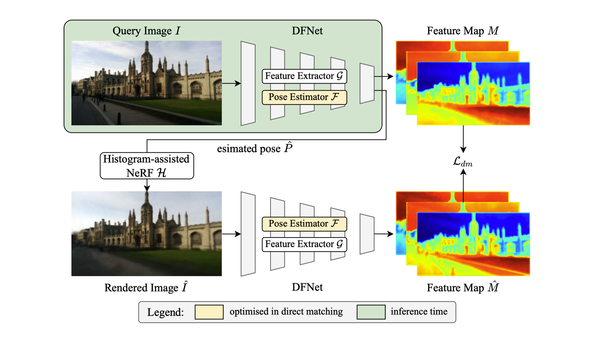

# DFNet: Enhance Absolute Pose Regression with Direct Feature Matching

**[Shuai Chen](https://scholar.google.com/citations?user=c0xTh_YAAAAJ&hl=en), [Xinghui Li](https://scholar.google.com/citations?user=XLlgbBoAAAAJ&hl=en), [Zirui Wang](https://scholar.google.com/citations?user=zCBKqa8AAAAJ&hl=en), and [Victor Prisacariu](https://scholar.google.com/citations?user=GmWA-LoAAAAJ&hl=en) (ECCV 2022)**

**[Project Page](https://dfnet.active.vision) | [Paper](https://arxiv.org/abs/2204.00559)**

[](https://arxiv.org/abs/2204.00559)

## Setup
### Installing Requirements
We tested our code based on CUDA11.3+, PyTorch 1.11.0+, and Python 3.7+ using [docker](https://docs.docker.com/engine/install/ubuntu/).

Rest of dependencies are in requirement.txt

### Data Preparation
- **7-Scenes**

We use a similar data preparation as in [MapNet](https://github.com/NVlabs/geomapnet). You can download the [7-Scenes](https://www.microsoft.com/en-us/research/project/rgb-d-dataset-7-scenes/) datasets to the `data/deepslam_data` directory.

Or you can use simlink

```sh
cd data/deepslam_data && ln -s 7SCENES_DIR 7Scenes
```

Notice that we additionally computed a pose averaging stats (pose_avg_stats.txt) and manually tuned world_setup.json in `data/7Scenes` to align the 7Scenes' coordinate system with NeRF's coordinate system. You could generate your own re-alignment to a new pose_avg_stats.txt using the `--save_pose_avg_stats` configuration.

- **Cambridge Landmarks**

You can download the Cambridge Landmarks dataset using this script [here](https://github.com/vislearn/dsacstar/blob/master/datasets/setup_cambridge.py). Please also put the pose_avg_stats.txt and world_setup.json to the `data/Cambridge/CAMBRIDGE_SCENES` like we provided in the source code.

## Training

Our method relies on a pretrained Histogram-assisted NeRF model and a DFNet model as we stated in the paper. We have provide example config files in our repo. The followings are examples to train the models.

- NeRF model

```sh
python run_nerf.py --config config_nerfh.txt
```

- DFNet model

```sh
python run_feature.py --config config_dfnet.txt
```

- Direct Feature Matching (DFNet<sub>dm</sub>)

```sh
python train.py --config config_dfnetdm.txt
```

## Evaluation
We provide methods to evaluate our models.
- To evaluate the NeRF model in PSNR, simply add `--render_test` argument.

```sh
python run_nerf.py --config config_nerfh.txt --render_test
```

- To evaluate APR performance of the DFNet model, you can just add `--eval --testskip=1 --pretrain_model_path=../logs/PATH_TO_CHECKPOINT`. For example:

```sh
python run_feature.py --config config_dfnet.txt --eval --testskip=1 --pretrain_model_path=../logs/heads/dfnet/checkpoint.pt
```

- Same to evaluate APR performance for the DFNet<sub>dm</sub> model

```sh
python train.py --config config_dfnetdm.txt --eval --testskip=1 --pretrain_model_path=../logs/heads/dfnetdm/checkpoint.pt
```

## Pre-trained model
We provide the 7-Scenes and Cambridge pre-trained models [here](https://www.robots.ox.ac.uk/~shuaic/DFNet2022/pretrain_models.tar.gz). Some models have slight better results than our paper reported. We suggest the models to be put in a new directory (`./logs/`) of the project.

Notice we additionally provided Cambridge's Great Court scene models, although we didn't include the results in our main paper for fair comparisons with other works. 

Due to my limited resource, my pre-trained models are trained using 3080ti or 1080ti. I noticed earlier that the model's performance might vary slightly (could be better or worse) when inferencing with different types of GPUs, even using the exact same model. Therefore, all experiments on the paper are reported based on the same GPUs as they were trained.

## Acknowledgement
We thank Michael Hobley, Theo Costain, Lixiong Chen, and Kejie Li for their generous discussion on this work.

Most of our code is built upon [Direct-PoseNet](https://github.com/ActiveVisionLab/direct-posenet). Part of our Histogram-assisted NeRF implementation is referenced from the reproduced NeRFW code [here](https://github.com/kwea123/nerf_pl/tree/nerfw). We thank [@kwea123](https://github.com/kwea123) for this excellent work!

## Citation
Please cite our paper and star this repo if you find our work helpful. Thanks!
```
@inproceedings{chen2022dfnet,
  title={{DFN}et: {E}nhance Absolute Pose Regression with Direct Feature Matching},
  author={Chen, Shuai and Li, Xinghui and Wang, Zirui and Prisacariu, Victor},
  booktitle={ECCV},
  year={2022}
}
```
